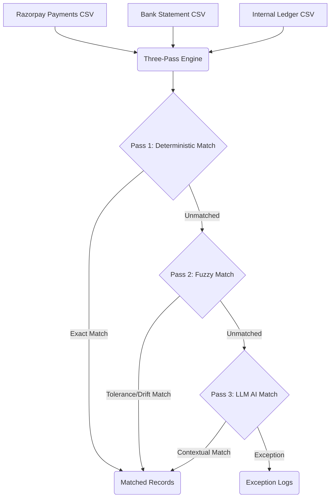

# FinReconcile AI

FinReconcile AI is an agentic finance reconciliation engine built for the Sept 5, 2026 buildathon. It automatically reconciles Razorpay gateway settlements against internal ledgers and bank statements using a three-pass engine.

## Architecture



## Setup Instructions

### Prerequisites
- Node.js (v18+)
- PostgreSQL database
- Gemini API Key

### 1. Environment Setup
Create a `.env` file in the `backend/` directory. You can copy the example:
```bash
cp backend/.env.example backend/.env
```
Ensure you provide your `DATABASE_URL` and `GEMINI_API_KEY`. The default model is `gemini-3.5-flash-lite`.

### 2. Backend & Database Setup
```bash
cd backend
npm install
npx prisma migrate deploy  # Apply migrations to the database
npm run generate:data      # Generate synthetic test data and ground truth
npm start                  # Start the backend Express server
```

### 3. Frontend Setup
In a separate terminal:
```bash
cd frontend
npm install
npm run dev                # Start the Next.js frontend
```

### 4. LLM Model Selection & Tradeoff
By default, the backend uses `gemini-3.5-flash-lite` (`GEMINI_MODEL="gemini-3.5-flash-lite"` with `LLM_MAX_RECORDS=50`).
* **Why not `gemini-3.7-flash`?** In Google AI Studio's free tier, preview flagship models like `gemini-3.7-flash` enforce a strict ceiling of **20 Requests Per Day (RPD)** per project.
* **Why `gemini-3.5-flash-lite`?** Standard Flash-Lite models provide a **1,000–1,500 RPD** quota on the free tier. This enables repeated evaluation runs, demo rehearsals, and grader testing on the free tier without hitting daily lockouts.
* **Pay-As-You-Go Upgrade**: If upgraded to Tier-1 billing, `GEMINI_MODEL` can be switched to `gemini-3.7-flash` or `gemini-2.5-flash` with unlimited daily quota and 1,000+ RPM.

## Running the End-to-End Demo in 5 Minutes

1. Follow the setup steps above to start both the backend (`http://localhost:3001`) and frontend (`http://localhost:3000`).
2. Open your browser to `http://localhost:3000`.
3. Upload the three generated CSV files found in the `data/` directory (`razorpay_payments.csv`, `bank_statement.csv`, `internal_ledger.csv`).
4. Click **Reconcile**. The engine will run the 3-pass process.
5. Review the results on the dashboard, broken down by Pass 1, Pass 2, and Pass 3 (LLM).
6. **(Optional Evaluator)**: To verify the accuracy of the engine against the synthetic ground truth, run the evaluator script in a separate terminal:
   ```bash
   cd backend
   npx tsx scripts/evaluate.ts
   ```
   This script calculates exact Precision, Recall, and F1 scores (overall and per anomaly type). 

## Known Limitations & Honest Edges

- **Split Transactions**: The deterministic and fuzzy passes (Pass 1 & 2) do not aggregate multi-credit bank splits. Splits cascade to Pass 3 (LLM) which attempts multi-record reasoning. Split accuracy is explicitly reported separately in `evaluate.ts`.
- **Duplicate Entries**: The synthetic generator and the engine currently do not generate or identify duplicate entries (double posting anomalies).
- **CORS**: CORS on the backend is intentionally configured for local development and hackathon evaluation (`http://localhost:3000`).
- **Free Tier Rate Limiting**: On the free tier, Pass 3 uses a 3.2s pacing delay and exponential backoff on transient errors (429/503) to respect quota boundaries. Unreviewed records are safely routed to the Exception Queue.
